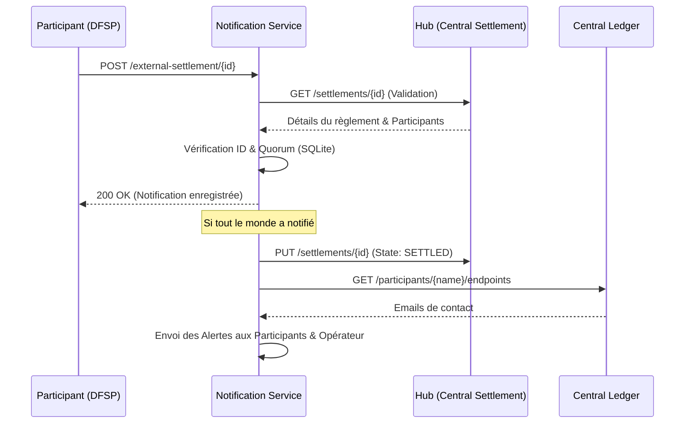

# Documentation : Service de Notification de Règlements Externes (Mojaloop)


---

## 1. Aspects Fonctionnels (Détails Métier)

### 1.1 Objectif du Système
Dans l'écosystème Mojaloop, le **règlement effectif** est la phase de dénouement financier final. Alors que le Hub gère la compensation (calcul des balances nettes), le transfert réel des fonds s'opère souvent via des systèmes bancaires externes (RTGS, SWIFT). 
L'**External Settlement Service** agit comme un tiers de confiance qui :
- Collecte les confirmations de virement des participants.
- Garantit qu'aucun cycle n'est clôturé sans une confirmation totale.
- Synchronise l'état digital (Mojaloop) avec la réalité bancaire (Virements réels).

### 1.2 Rôles et Responsabilités
- **Participant (DFSP)** : Doit notifier ce service dès que son virement sortant est validé par sa banque.
- **Hub Operator** : Surveille la progression via ce service et intervient en cas de blocage d'un participant.
- **Notre Service** : Arbitre la clôture du cycle en fonction du quorum atteint.

### 1.3 Déclencheur et Cycle de Vie (Le voyage d'un règlement)
Le microservice n'intervient qu'à un moment très précis de la vie du Hub Mojaloop. Voici les étapes détaillées :

1. **La Fermeture de la Fenêtre (Window)** : Les transactions s'accumulent pendant une période. Une fois finie, l'administrateur ferme la fenêtre. Plus aucun transfert ne peut y entrer.
2. **Le Calcul du Règlement (Settlement)** : Le Hub calcule alors qui doit quoi à qui. Un objet *Settlement* est créé.
3. **Le Moment de la Notification (L'activation)** : C'est ici que le service devient actif. Le participant peut envoyer une notification lorsque le règlement est dans l'un des états suivants :
   - **PS_TRANSFERS_RECORDED** : Le Hub a fini ses calculs. Les montants sont figés et consultables. C'est le signal pour les banques d'initier leurs virements réels.
   - **PS_TRANSFERS_RESERVED** : Le Hub a "gelé" les fonds internes des participants. Il s'est assuré que chaque banque débitrice a la liquidité nécessaire.
   - **PS_TRANSFERS_COMMITTED** : Les écritures comptables internes sont faites dans les livres du Hub. C'est la dernière étape avant la clôture finale.
4. **La Finalisation (SETTLED)** : Une fois le quorum atteint, le service ordonne au Hub de passer à **SETTLED**, marquant la fin officielle du cycle.

#### Pourquoi ces états précisément ?
- **Dès PS_TRANSFERS_RECORDED** : Parce que les chiffres sont **figés**. Une banque peut légitimement prouver un virement car elle connaît le montant exact et définitif.
- **Pourquoi pas avant ?** Si le service acceptait des notifications en `PENDING_SETTLEMENT`, une banque pourrait confirmer un virement dont le montant n'est pas encore calculé (elle confirmerait l'inconnu, ce qui est dangereux).


Notre service accepte ces trois états car, dans la réalité, une banque peut effectuer son virement réel à n'importe lequel de ces moments dès que les chiffres ne peuvent plus changer.

---

## 2. Aspects Techniques (Architecture et Stack)

### 2.1 Stack Technologique
- **Back-end** : Python 3.12+ avec FastAPI.
- **Persistance** : SQLite via SQLAlchemy pour le suivi des notifications et l'idempotence.
- **Communication** : REST API (JSON) et **SMTP Gmail** (via `smtplib`) pour les notifications sortantes.

### 2.2 Schéma d'Architecture de Données (Base SQLite)
Table `notifications` :
- `id` (PK) : Identifiant interne.
- `settlement_id` : ID officiel du règlement dans Mojaloop.
- `participant_id` : ID technique du participant (ex: 2, 5, 6).
- `amount` : Montant déclaré.
- `currency` : Devise (ex: XOF, XTS).
- `reference` : Preuve de virement (numéro RTGS/SWIFT).
- `settled_at` : Date réelle du virement déclarée par le participant.
- `created_at` : Timestamp de réception système (UTC).

### 2.3 Ports et Connectivité
| Composant | Port | Type d'accès |
| :--- | :--- | :--- |
| Central Settlement (Hub) | 3000/3001 | Tunnel SSH + Port-Forward K8s |
| Central Ledger | 4001 | Tunnel SSH + Port-Forward K8s |
| External Settlement Service | 8000 | Serveur Uvicorn local |

---

## 3. Flux de Notification et Processus Détaillé


**Phase de Réception** : Le processus démarre lorsqu'un participant (DFSP) appelle l'endpoint `POST /external-settlement/{id}` avec sa preuve de paiement.

Le flux se décompose ensuite en 7 étapes critiques de traitement et de sécurité :

#### 1. Récupération et préparation des données (Validation Pydantic)
```python
class SettlementNotificationRequest(BaseModel):
    participantId: str
    amount: float = Field(..., gt=0)
    currency: str = Field(..., min_length=3, max_length=3)
    reference: str = Field(..., min_length=1)
    settledAt: Optional[str] = None
```
- **Ce que ça fait** : Le service utilise **Pydantic** pour valider automatiquement la complétude et le type des données envoyées par le participant.
- **Pourquoi c'est important** : Cela garantit que le `participantId` est présent, que le `amount` est un nombre positif et que la `currency` respecte le format ISO. Si ces conditions ne sont pas remplies, l'API rejette la requête avec une erreur **422 Unprocessable Entity**.

#### 2. Double vérification avec le Hub (Le "Check" de sécurité)
```python
hub_response = requests.get(f"{HUB_BASE_URL}/settlements/{settlement_id}", verify=False)
```
- **Ce que ça fait** : Le service appelle l'API réelle du Hub Mojaloop pour lui demander : "Est-ce que le règlement numéro {ID} existe vraiment chez toi ?".
- **Pourquoi c'est important** : Cela évite qu'un participant n'envoie des notifications pour des règlements fictifs. On se base sur la "Source de Vérité" qui est le Hub.

#### 3. Validation de l'état du règlement
```python
state = settlement_data.get("state")
allowed_states = ["PS_TRANSFERS_RECORDED", "PS_TRANSFERS_RESERVED", "PS_TRANSFERS_COMMITTED", "SETTLED"]
```
- **Ce que ça fait** : On vérifie que le règlement est dans un état où il est "prêt" à recevoir de l'argent (par exemple RECORDED ou COMMITTED).
- **Pourquoi c'est important** : On ne veut pas accepter de notification si le règlement est déjà annulé (ABORTED).

#### 4. Vérification d'appartenance et Conformité Métier
```python
# Recherche du compte correspondant à la devise notifiée (Gestion Multi-devises)
target_account = next((acc for acc in participant_accounts if acc.get("netSettlementAmount", {}).get("currency") == currency), None)
hub_amount = target_account.get("netSettlementAmount", {}).get("amount")

if abs(float(amount) - abs(float(hub_amount))) > 0.01:
    raise HTTPException(...)
```
- **Ce que ça fait** : Le code compare le montant et la devise notifiés avec les données réelles du Hub pour ce participant spécifique. Il utilise la valeur absolue (`abs()`) pour gérer les montants négatifs (débiteurs) du Hub.
- **Pourquoi c'est important** : **Intégrité financière**. On rejette la notification si le participant déclare avoir payé 1000 alors que le Hub attend 1200. Cela garantit que le virement bancaire correspond exactement à l'obligation calculée.

#### 5. Gestion de l'idempotence (Anti-doublon)
```python
existing = db.query(ExternalSettlementNotification).filter(...)
```
- **Ce que ça fait** : On regarde dans la base locale SQLite si ce participant a déjà envoyé cette notification.
- **Pourquoi c'est important** : Si un participant clique deux fois sur "Envoyer", ou si le réseau bugge, on évite d'enregistrer deux fois la même information.

#### 6. Enregistrement local
```python
notification = ExternalSettlementNotification(...)
db.add(notification)
db.commit()
```
- **Ce que ça fait** : Une fois que toutes les vérifications sont OK, on sauvegarde la preuve du règlement dans la base de données locale.
- **Pourquoi c'est important** : C'est ce qui permet de garder une trace (audit) et de compter combien de personnes ont déjà payé.

#### 7. Mise à jour granulaire et Quorum (Étape Finale)
- **Mise à jour Participant** : Dès réception d'une notification valide, le service envoie un `PUT` au Hub pour passer le compte spécifique de ce participant à l'état **SETTLED**.
- **Quorum** : Le code compte les notifications reçues. Si le quota est atteint, il ordonne au Hub de clôturer définitivement le règlement global.
- **Remplacement** : Les alertes sont désormais envoyées via le serveur **SMTP Gmail** 
- **Filtrage Intelligent** : Le service détecte et ignore les emails malformés ou les "placeholders" (ex: `{$inputs.email}`) souvent présents dans les environnements de test du Ledger.

---

### Diagramme de Flux (Séquence)


---

## 4. Description des API Utilisées

### 4.1 Notre Service (Inbound)
- **POST `/external-settlement/{settlement_id}`**
  - **Body détaillé** : 
    - `participantId` (string, requis) : ID du FSP.
    - `amount` (float, requis, > 0) : Montant du virement réel.
    - `currency` (string, requis, ISO 3 lettres) : Devise du virement.
    - `reference` (string, requis) : Preuve de paiement.
  - **Succès (200)** : Retourne l'état du quorum.
  - **Erreur (422)** : Données mal formées ou incomplètes (Validation Pydantic).
  - **Erreur (400)** : Incohérence de montant ou de devise avec le Hub.

### 4.2 Central Settlement Hub (Outbound)
- **GET `/v2/settlements/{id}`** : Récupère la liste des participants et leurs comptes présents dans le règlement.
- **PUT `/v2/settlements/{id}`** : Change l'état global du règlement en `SETTLED`.

### 4.3 Central Ledger (Outbound)
- **GET `/participants`** : Liste de tous les participants pour le mapping ID -> Nom.
- **GET `/participants/{name}/endpoints`** : Récupération des emails de type `SETTLEMENT_TRANSFER_POSITION_CHANGE_EMAIL`.

---

## 5. Logique de Mapping (Points Clés)

Un défi technique majeur de cette implémentation est la réconciliation des identités. Les IDs numériques dans les Settlements (`id: 2`, `id: 6`) ne sont pas universels. 
**La solution implémentée** consiste à utiliser l'**Account ID** comme clé de jointure unique :
1. Extraire l'ID du compte depuis le règlement (`/v2/settlements/{id}`).
2. Croiser cet ID avec la liste globale `/participants` du Ledger.
3. Résoudre le nom lisible (ex: `payerfsp`) pour l'affichage.

---

## 6. Guide de Test : Happy Path et Erreurs

### 6.1 Le "Happy Path" (Chemin Nominal)
Scénario de succès total :
1. **Action** : Le dernier participant (ex: ID 6) envoie sa notification (POST /external-settlement/{settlement_id}).
2. **Réaction** : Le service détecte que le quorum est de 4/4.
3. **Sortie** : 
   - `HTTP 200 OK`
   - Log : `Alerte envoyée au testfsp2(6) sur le email@test.com : Settlement 32 CONFIRMÉ.`
   - Log : `Alerte envoyée à l'OPÉRATEUR HUB : Cycle de règlement 32 CLÔTURÉ.`

### 6.2 Matrice de Gestion des Erreurs

| Erreur | Code | Cause | Solution |
| :--- | :--- | :--- | :--- |
| **Malformed syntax** | 3101 | Valeur de filtre invalide (ex: `state=CLOSED` pour un settlement). | Utiliser un état valide (`PS_TRANSFERS_RECORDED`, etc.). |
| **Validation Error** | 3100 | Paramètres obligatoires manquants dans l'URL (GET). | Ajouter au moins un paramètre (ex: `?state=OPEN`). |
| **Unknown URI** | 3002 | Préfixe `/v2` manquant dans l'URL ou mauvais port. | Vérifier l'URL (doit inclure `/v2`) et la configuration. |
| **Not Found** | 3100 | Aucun settlement ne correspond aux filtres appliqués. | Vérifier si des règlements existent dans cet état. |
| **Missing Element** | 3102 | Champ obligatoire absent du body (ex: `settlementModel`). | Inclure tous les champs requis dans le JSON. |
| **Forbidden** | 403 | Le participant tente de notifier un règlement dont il ne fait pas partie. | Vérifier le `participantId` dans le JSON. |
| **Conflict** | 409 | Notification déjà enregistrée (Idempotence). | Ignorer ou vérifier la base SQLite. |
| **Timeout/Host Unreach.** | 503 | Tunnel SSH ou Port-Forward Kubernetes interrompu. | Relancer les tunnels et le forward via `kubectl`. |
| **Invalid State** | 400 | Le règlement est déjà `SETTLED` ou a été `ABORTED`. | Utiliser un nouveau `settlement_id` en cours. |

### 6.3 Exemples de requêtes et erreurs réelles (Troubleshooting)

Voici des exemples concrets de commandes `curl` rencontrées lors des phases de tests et les réponses d'erreurs renvoyées par le Hub :

#### Erreur 3101 : Syntaxe incorrecte (Mauvais état)
```bash
# Erreur : Utilisation de state=CLOSED (état de fenêtre) pour un settlement
curl "http://localhost:3000/v2/settlements?state=CLOSED" | jq
```
**Réponse :**
```json
{
  "errorInformation": {
    "errorCode": "3101",
    "errorDescription": "Malformed syntax - \"state\" must be one of [PENDING_SETTLEMENT, PS_TRANSFERS_RECORDED, ...]"
  }
}
```

#### Erreur 3100 : Validation (Paramètres manquants)
```bash
# Erreur : Oubli des filtres obligatoires pour lister les règlements
curl http://localhost:3000/v2/settlements | jq
```
**Réponse :**
```json
{
  "errorInformation": {
    "errorCode": "3100",
    "errorDescription": "Generic validation error - Use at least one parameter: state, fromDateTime, ..."
  }
}
```

#### Erreur 3002 : URL Inconnue (Mauvais préfixe)
```bash
# Erreur : Oubli du /v2 ou mauvais port/path
curl http://localhost:3007/health | jq
```
**Réponse :**
```json
{
  "errorInformation": {
    "errorCode": "3002",
    "errorDescription": "Unknown URI - Not Found"
  }
}
```

#### Erreur 3102 : Champ manquant (Body JSON)
```bash
# Erreur : Oubli du settlementModel dans la création du règlement
curl -X POST http://localhost:3000/v2/settlements \
  -d '{"settlementWindows": [{"id": 33}], "reason": "Test"}'
```
**Réponse :**
```json
{
  "errorInformation": {
    "errorCode": "3102",
    "errorDescription": "Missing mandatory element - \"settlementModel\" is required"
  }
}
```

---

## 7. Prérequis et Installation

1. **Python environnement** : `pip install -r requirements.txt`.
2. **Fichier .env** : Configurer `HUB_BASE_URL` et `LEDGER_URL` avec les IPs/Ports des tunnels.
3. **Tunnels SSH** : Indispensables pour mapper les ports `3001` et `4001` du serveur BFT vers votre environnement local.
4. **Base de données** : Automatiquement créée au premier lancement (`notifications.db`).

---
*Fin du rapport de documentation.*
